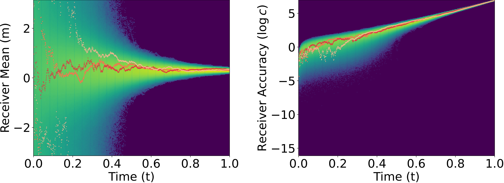
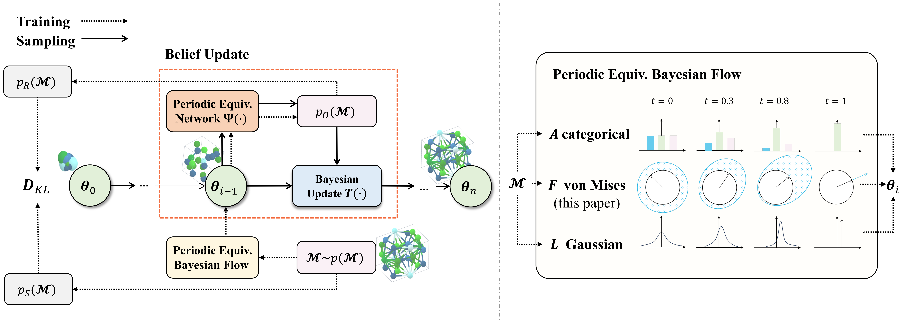

## [ICLR 2025 Spotlight] A Periodic Bayesian Flow for Material Generation (CrysBFN) 

[2025/07] We upload the pretrained checkpoints [here](https://drive.google.com/drive/folders/1W5kGiZYFRJZiyKyTwCdcPk9lbjTsTCO-?usp=drive_link) with instructions below.

This is the implementation code for ICLR 2025 Spotlight paper CrysBFN.

[\[paper\]](arxiv.org/pdf/2502.02016) 
[\[website\]](https://t.co/a4x4qlROH7)


Here is the visualization of the proposed periodic Bayesian flow:




And here is the visualization of the unified BFN generation framework  

<!-- Here is an animation of the generation process.
 -->

## Install
### 1. Set up environment variables
Firstly please set up dot environment variables in .env file.
- `PROJECT_ROOT`: path to the folder that contains this repo. e.g. /data/wuhl/CrysBFN
- `HYDRA_JOBS`: path to a folder to store hydra outputs. This is the directory where we store checkpoints. e.g. /data/wuhl/CrysBFN/hydra
- `WABDB`: path to a folder to store wandb outputs e.g. /data/wuhl/CrysBFN/wandb

### 2. Install with Mamba
We recommend using [Mamba](https://github.com/conda-forge/miniforge) or conda (with libmamba solver) to build the python environment. It may take several minutes to solve the environment—please wait patiently.
```
conda env create -f environment.yml
conda activate crysbfn
```

## Training, Sampling and Evaluation
We use shell scripts in `scripts` to manage all pipelines. Hyper-parameters can be set in those shell script files. Scripts to launch experiments can be found in `scripts/csp_scripts` and `scripts/gen_scripts` for crystal structure prediction task and de novo generation task.
### Training

For launching a de novo generation task training experiment, please use the following code:
```
bash ./scripts/gen_scripts/mp20_exps.sh
```
Every first run on each dataset requires longer time (< 1 hour) for preparing the cache processed data.
For launching a crystal structure prediction task training experiment, please use the following code:
```
bash ./scripts/csp_scripts/mp20_exps.sh
```
### Sampling and Evaluating
After training, please modify the MODEL_PATH variable as the hydra directory of the training experiment. Then, use the below code to generate and evaluating samples.
```
bash scripts/csp_scripts/eval_mp20.sh
```

### Use Our Checkpoints
We provide our checkpoints [here](https://drive.google.com/drive/folders/1W5kGiZYFRJZiyKyTwCdcPk9lbjTsTCO-?usp=drive_link). Here is a fastest example (NFE=10) to use the checkpoint to verify your installation:

1. Download the zip file into the hydra directory and unzip it
```
cd hydra
unzip ./mp20_csp_s10.zip
```
2. Modify the first line in `scripts/csp_scripts/mp20_eval.sh`
```
MODEL_PATH=/data/wuhl/CrysBFN/hydra/mp20_csp_s10 # modify according to your path
```
3. Run the code to sample and eval
```
cd ..
bash scripts/csp_scripts/mpts52_eval.sh
```
### Toy Example
We provide toy examples with minimal components illustrating how BFNs work in `./toy_example`.

## Citation
If you find this repo or our paper useful, please cite our paper :\)
```
@misc{wu2025periodicbayesianflowmaterial,
        title={A Periodic Bayesian Flow for Material Generation}, 
        author={Hanlin Wu and Yuxuan Song and Jingjing Gong and Ziyao Cao and Yawen Ouyang and Jianbing Zhang and Hao Zhou and Wei-Ying Ma and Jingjing Liu},
        year={2025},
        eprint={2502.02016},
        archivePrefix={arXiv},
        primaryClass={cs.LG},
        url={https://arxiv.org/abs/2502.02016}, 
  }
```

## Acknowledgement 
The main structure of this repository is mainly based on [CDVAE](https://github.com/txie-93/cdvae). The environment configuration file is modified after environment.yml in [FlowMM](https://github.com/txie-93/cdvae).